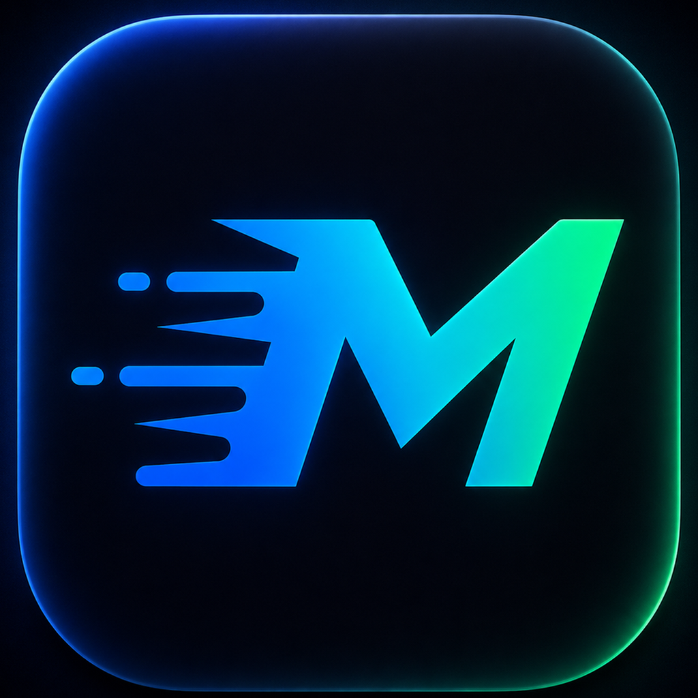
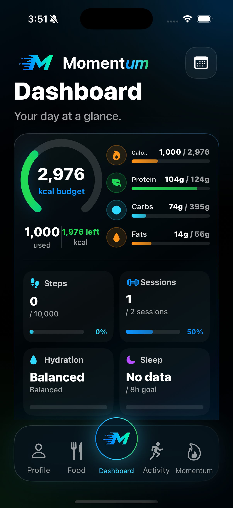
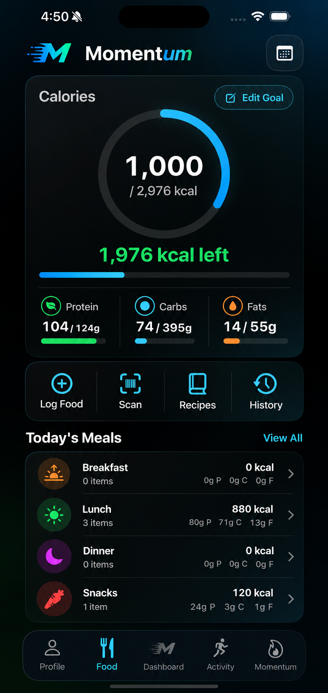
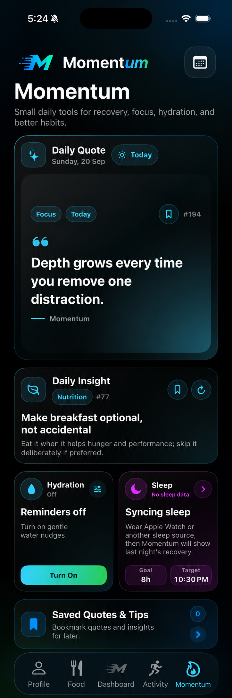
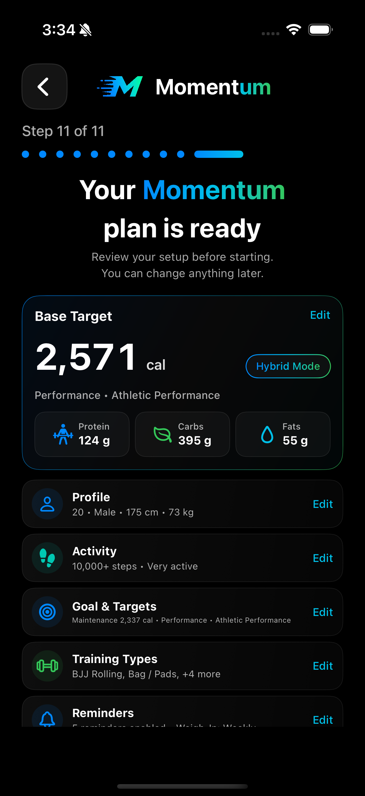
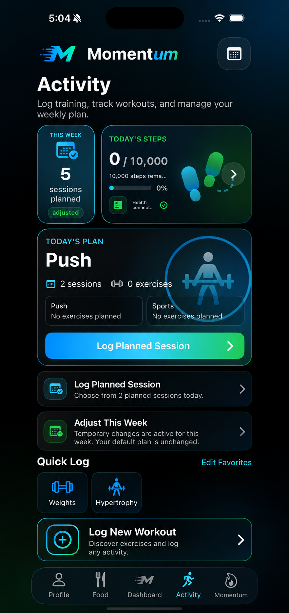
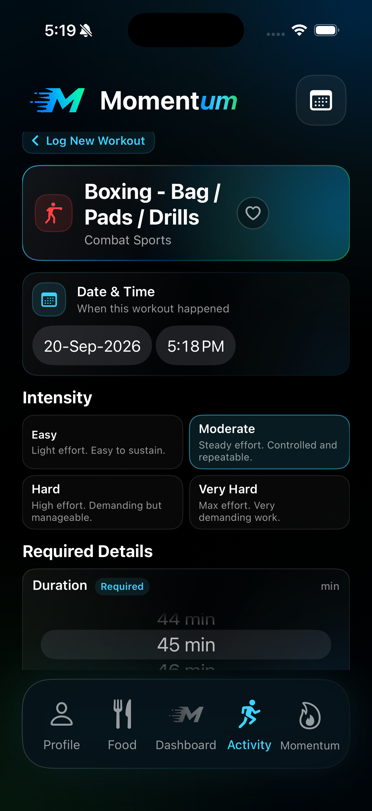
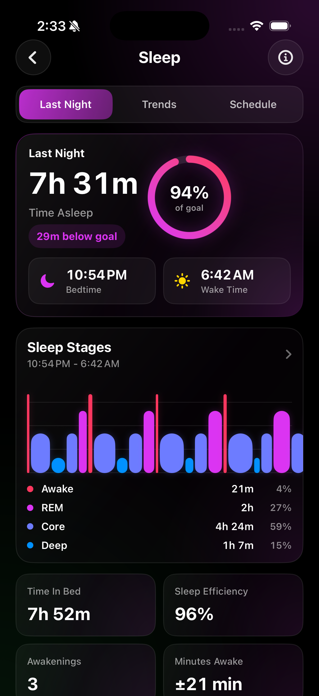
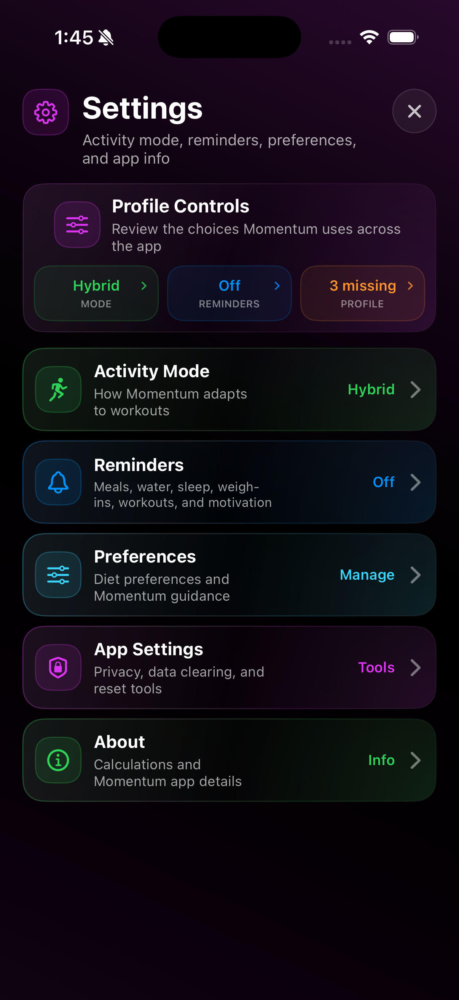

<div align="center">



# Momentum

**A native iOS health and fitness companion that brings nutrition, activity, recovery, and daily guidance into one adaptive experience.**


</div>

> [!IMPORTANT]
> **This is a public showcase repository containing product documentation and screenshots only.** The complete Momentum source code is maintained in a private repository and is not included here.

> [!NOTE]
> Momentum is an actively developed portfolio project and is not currently published on the App Store.

## Product preview

<p align="center">
  
  &nbsp;
  
  &nbsp;
  
</p>

## Why Momentum

Health and fitness data is often spread across separate calorie trackers, workout logs, sleep apps, and reminder tools.

Momentum explores a more cohesive approach: one place where a user's goals, training, nutrition, recovery, and routines can inform the next useful action.

The project is built around three principles:

- **Personal, not generic** — targets, reminders, insights, and guidance respond to the user's profile and preferences.
- **Useful without being overwhelming** — the dashboard prioritizes today's most relevant information and actions.
- **Transparent calculations** — activity modes make it clear when workout energy is already included in a target and when logged activity should adjust it.

## Highlights

### Adaptive dashboard

- Daily calorie and macronutrient progress with activity-aware energy budgeting
- Contextual priorities generated from nutrition, workouts, steps, hydration, and sleep
- Today's planned sessions, weekly completion progress, and quick logging actions
- Stable daily insights that do not unexpectedly rerandomize when revisiting a screen

### Nutrition tracking

- Meal-based food diary with editable serving sizes and detailed nutrient breakdowns
- Food search, recent and frequent foods, saved meals, and custom food creation
- Barcode scanning with `VisionKit`, local caching, and an optional configurable backend lookup
- Daily and historical nutrition summaries that preserve the targets used on each day

### Activity and training

- **145 activity types across 14 categories**, including strength training, running, combat sports, team sports, mobility, rehabilitation, and adaptive activity
- Workout-specific logging fields instead of a single generic form
- MET-based energy estimation with adjustments for duration, intensity, distance, load, terrain, elevation, intervals, and other relevant inputs
- Reusable weekly plans, one-week adjustments, planned-session matching, and workout history

### Recovery and Apple Health

- Read-only `HealthKit` integration for step count and sleep analysis
- Daily step progress, sleep duration and stages, trends, and configurable sleep goals
- Hydration scheduling that respects waking hours and the user's sleep schedule
- Background health-data observation for timely goal and recovery updates

### Personalized Momentum guidance

- **608 categorized motivational quotes** and **330 educational tips**
- Five guidance styles: Balanced, Discipline & Focus, Growth & Confidence, Performance, and Calm & Resilience
- Weighted content selection targeting approximately **70% preference-matched content and 30% broader content**
- Separate quote and educational-tip systems with category-aware selection and recent-repeat prevention
- Preference changes affect future selections without rewriting saved content or history

### Notification system

- A master notification control with independently configurable reminder types
- Meal, hydration, weigh-in, workout, sleep, step-goal, weekly-review, motivation, and daily-insight notifications
- Wind-down, bedtime, and wake reminders tied to the configured sleep schedule
- Deep links, notification actions, snoozing, and collision-aware scheduling

## Product walkthrough

### Onboarding and dashboard

| Personalized setup | Daily overview |
| --- | --- |
|  |  |

### Nutrition and training

| Food diary | Activity overview |
| --- | --- |
|  |  |

| Workout logger | Daily Momentum |
| --- | --- |
|  |  |

### Recovery and personalization

| Sleep insights | Preferences and reminders |
| --- | --- |
|  |  |

## Architecture

Momentum follows an **MVVM-inspired, service-oriented architecture**. The design keeps presentation, state management, domain calculations, persistence, and Apple-platform integrations separated so features can evolve without compromising the application's core calculation rules.

```text
SwiftUI interface
        │
        ▼
Observable view models
        │
        ├── Nutrition and activity calculation services
        ├── Recommendation and content-selection services
        ├── HealthKit and notification coordinators
        └── Repositories and local persistence stores
```

Key engineering decisions include:

- **Centralized calculations** keep calorie, macro, and workout adjustments consistent across the application.
- **Typed `Codable` domain models** support reliable persistence and migration from earlier settings formats.
- **Idempotent reminder reconciliation** updates only notifications managed by Momentum.
- **Separated content state** prevents daily selections, saved items, and history from overwriting one another.
- **Metadata-driven personalization** uses weighted selection rather than runtime text classification or duplicate content libraries.
- **Protocol-oriented service boundaries** keep platform integrations and domain behavior independently testable.

## Technology stack

| Area | Technology |
| --- | --- |
| Language | Swift 5 |
| Interface | SwiftUI |
| State & observation | Combine, `ObservableObject` |
| Health data | HealthKit |
| Barcode capture | VisionKit |
| Notifications | UserNotifications, UIKit app-delegate integration |
| Networking | URLSession, Codable |
| Persistence | UserDefaults-backed stores and snapshots |
| Testing | XCTest |
| Dependencies | Apple frameworks only; no third-party packages |

## Quality and verification

The private project currently includes **17 passing automated tests** covering:

- Nutrition and activity calculation invariants
- Activity-mode target behavior
- Persistence and backward-compatible settings migration
- Reminder compatibility and hydration scheduling
- Profile-completion rules
- Content tagging and balanced rotation
- Repeat prevention and weighted personalization

Core calculations are isolated from presentation code so behavior can be tested independently of UI state.

## Current status

### Implemented

- End-to-end onboarding and editable profile settings
- Dashboard, nutrition diary, workout logging, weekly planning, and history
- HealthKit step and sleep integration
- Hydration, sleep, and notification controls
- Categorized quote and educational-tip libraries with guidance personalization
- Local persistence and automated coverage for core logic

### In development

- Production food-data coverage beyond the configurable barcode endpoint
- Broader automated UI and accessibility testing
- Final device QA and performance tuning
- App Store preparation

## Privacy

Momentum requests **read-only access** to step and sleep data through Apple Health.

Health access is optional, and core profile, preference, diary, workout, and saved-content data is currently stored locally on the device.

---

<div align="center">

Designed and developed by <strong>Adil Babri</strong>.

</div>
